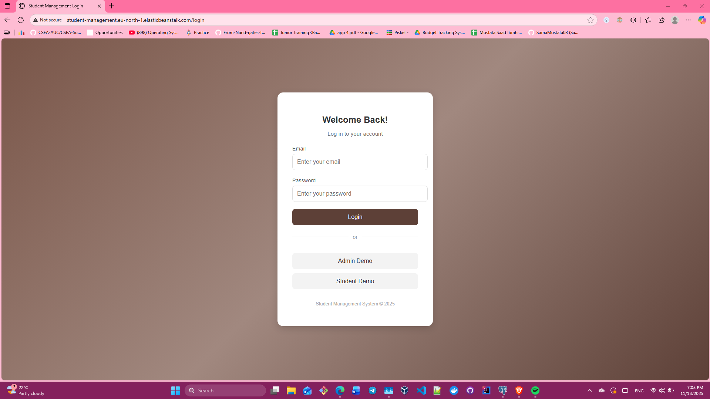
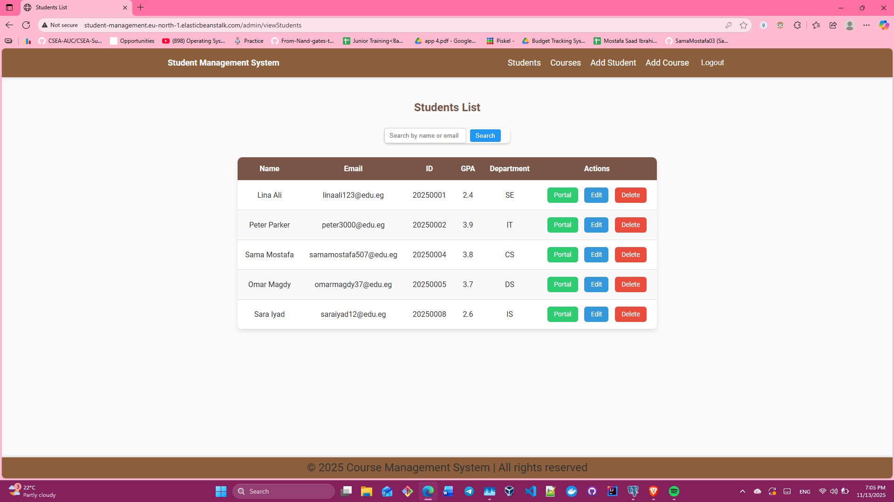
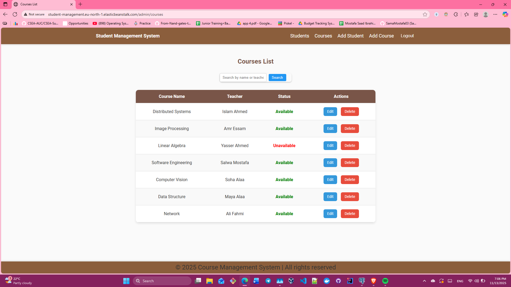

# Spring-Thymeleaf Student Management System

## 🌐 Live Demo
**Deployed on AWS Elastic Beanstalk:**   [http://student-management.eu-north-1.elasticbeanstalk.com/](http://student-management.eu-north-1.elasticbeanstalk.com/)

👉 **Try it out:**  You can explore both **Admin** and **Student** demo modes — **no login credentials required!**

## Overview
**Spring-Thymeleaf Student Management System** is a full-stack CRUD web application built with **Spring Boot**, **Spring Security**, **Thymeleaf**, **JPA**, and **PostgreSQL**.  
It allows users to manage students and courses records with ease — including adding, updating, deleting, viewing, and searching — through a clean and responsive interface.

This project is fully deployed on **AWS**, utilizing:
- **AWS Elastic Beanstalk** for hosting and scaling the Spring Boot application.
- **AWS RDS (PostgreSQL)** for a managed, reliable, and persistent cloud database.

---

## Features
- Secure login & logout with Spring Security
- Role-based redirects for Admin and Student
- Demo Mode: one-click login for testing both roles
- Add, edit, and delete students  
- Search by name or email for student record 
- Add, edit, and delete courses
- View all students and courses in a neatly formatted table  
- Clean and responsive Thymeleaf-based UI
- Persistent data storage via AWS RDS (PostgreSQL)
- Deployed and managed via AWS Elastic Beanstalk
---

## Tech Stack
| Layer | Technology |
|-------|-------------|
| **Backend** | Spring Boot, Spring MVC, Spring Security, Spring Data JPA |
| **Frontend** | Thymeleaf, HTML, CSS |
| **Database** | PostgreSQL (Hosted on AWS RDS) |
| **Cloud Platform** | AWS Elastic Beanstalk |
| **Build Tool** | Maven |

---

## How to Run Locally
1. Clone the repository

2. Update application.properties with your PostgreSQL credentials

3. Run the Spring Boot application

4. Visit http://localhost:5000 in your browser

## Demo Screenshots
**Login Page**

**Admin:**

  

**Student:**

